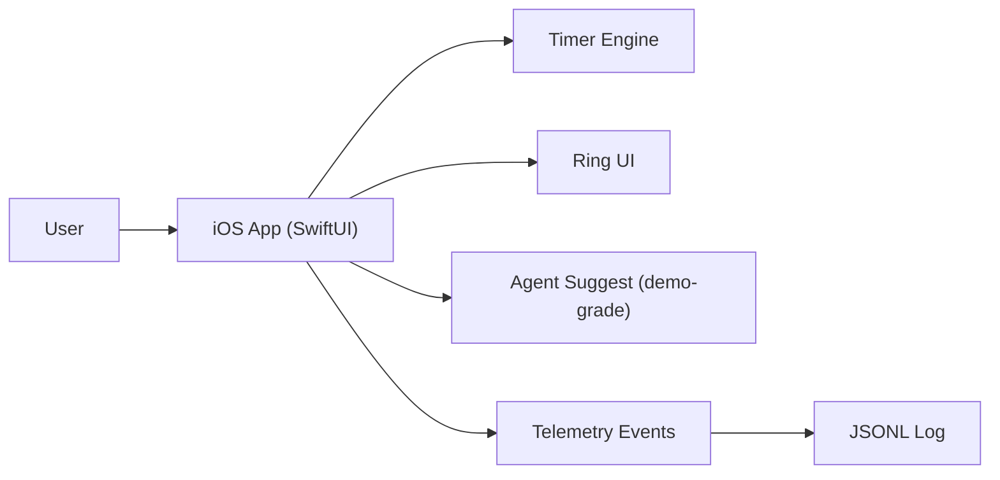

# System Overview (Hackathon Demo)

This repo is optimized for shipping a **polished demo**, not a full production platform.

## What exists today (in this repo)
- **iOS app (SwiftUI)**: `apps/ios/TimeBite/`
  - Ring timer UI + task list lives in `apps/ios/TimeBite/TimeBite/App/RootView.swift`
  - Timer engine lives in `apps/ios/TimeBite/TimeBite/Services/Core/TimeBiteEngine.swift`
- **Agent/automation experiments (Python)**: `services/agents/`
- **Telemetry helper (Python)**: `services/telemetry.py` (writes JSONL to `data/telemetry_runs/runs.jsonl`)

## Demo architecture (minimal)

## Data model (demo-scale)
- **Task**: title, category, duration, remaining, status (running/paused/completed)
- **Daily Intent**: 2–3 outcomes for today (local only)
- **Reflection**: done/partial/missed per intent lane + note
- **Telemetry event**: timestamped JSON payload for replay + metrics

## Key flows
1. **Intent → Suggestion**
   - Intent constrains what “good” looks like today.
2. **Suggestion → Timer**
   - Accept suggestion (or pick task) → start timer.
3. **Timer → Ring**
   - Remaining time updates every tick; ring renders progress.
4. **Completion → Reflection**
   - User records outcome and score.
5. **All steps → Telemetry**
   - Every step emits events for proof + metrics.

## Guardrails (hackathon demo)
- Only one active timer at a time.
- Suggestions are explainable (1-line reason).
- Storage is local and deterministic (reliability over “smartness”).

## Terminology (avoid ambiguity)
- **2D:** “Activity Rings-style progress ring” (generic: circular progress indicator)
- **3D:** “torus progress ring” (visionOS)
- Canonical reference: `docs/focus-os.md`
