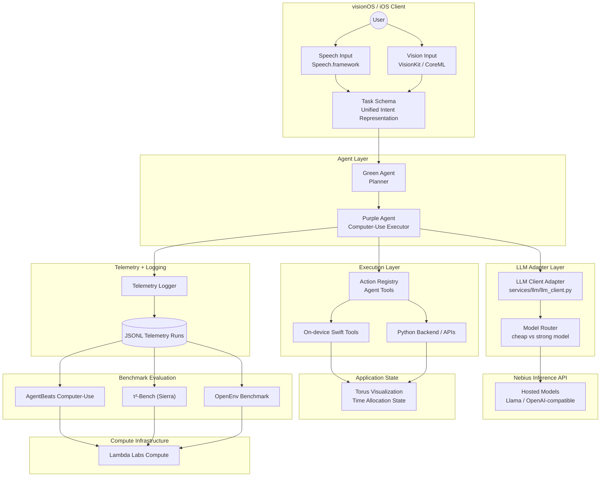

# System architecture

High-level flow for the AgentBeats / TimeBite agent stack. Renders as a diagram on GitHub.

```mermaid
flowchart TB

%% ================= CLIENT =================
subgraph Client["visionOS / iOS Client"]
User(("User"))

SpeechApple["Speech Input<br/>Speech.framework"]
VisionInput["Vision Input<br/>VisionKit / CoreML"]

TaskSchema["Task Schema<br/>Unified Intent Representation"]
end

User --> SpeechApple --> TaskSchema
User --> VisionInput --> TaskSchema

%% ================= AGENT LAYER =================
subgraph Agents["Agent Layer"]
GreenAgent["Green Agent<br/>Planner"]

PurpleAgent["Purple Agent<br/>Computer-Use Executor"]
end

TaskSchema --> GreenAgent
GreenAgent --> PurpleAgent

%% ================= LLM ADAPTER =================
subgraph LLM["LLM Adapter Layer"]
LLMClient["LLM Client Adapter<br/>services/llm/llm_client.py"]

Router["Model Router<br/>cheap vs strong model"]
end

PurpleAgent --> LLMClient
LLMClient --> Router

%% ================= INFERENCE =================
subgraph Nebius["Nebius Inference API"]
NebiusModels["Hosted Models<br/>Llama / OpenAI-compatible"]
end

Router --> NebiusModels

%% ================= TOOL EXECUTION =================
subgraph Tools["Execution Layer"]
ActionRegistry["Action Registry<br/>Agent Tools"]

SwiftTools["On-device Swift Tools"]

Backend["Python Backend / APIs"]
end

PurpleAgent --> ActionRegistry
ActionRegistry --> SwiftTools
ActionRegistry --> Backend

%% ================= STATE =================
subgraph AppState["Application State"]
Torus["Torus Visualization<br/>Time Allocation State"]
end

SwiftTools --> Torus
Backend --> Torus

%% ================= TELEMETRY =================
subgraph Telemetry["Telemetry + Logging"]
Logger["Telemetry Logger"]

Store[("JSONL Telemetry Runs")]
end

PurpleAgent --> Logger
Logger --> Store

%% ================= EVALUATION =================
subgraph Evaluation["Benchmark Evaluation"]
AgentBeats["AgentBeats Computer-Use"]

TauBench["τ²-Bench (Sierra)"]

OpenEnv["OpenEnv Benchmark"]
end

Store --> AgentBeats
Store --> TauBench
Store --> OpenEnv

%% ================= COMPUTE =================
subgraph Compute["Compute Infrastructure"]
Lambda["Lambda Labs Compute"]
end

AgentBeats --> Lambda
TauBench --> Lambda
OpenEnv --> Lambda
```
